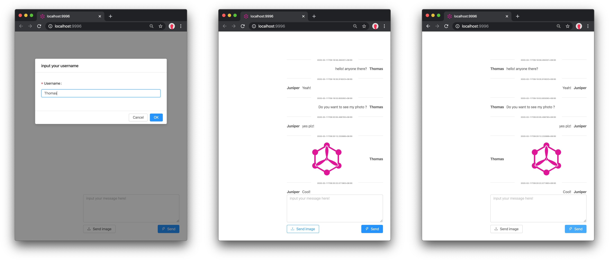
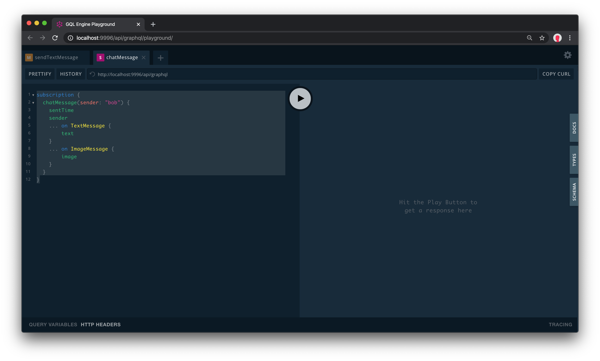

# Chatbox by gqlengine


**chatbox** demostrates a message box for multiple users (each page as a user), it's an  example shows how powerful by GraphQL subscription which fully supported by GQLEngine.


get the demo:

```
go get github.com/gqlengine/chatbox@master
```


run and open at: http://localhost:9996/





you can also debug with Playground by subscription the **chatMessage**


```graphql
subscription {
  chatMessage(sender: "bob") {
    sentTime
    sender
    ... on TextMessage {
        text
    }
    ... on ImageMessage {
        image
    }
  }
}
```




